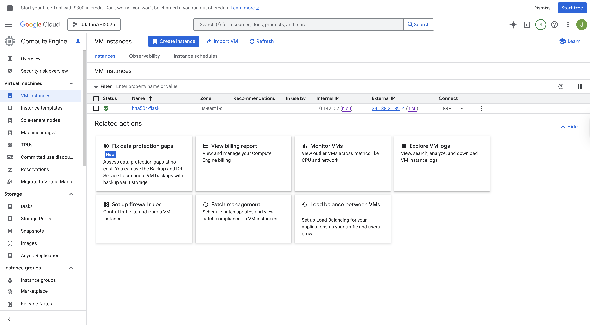
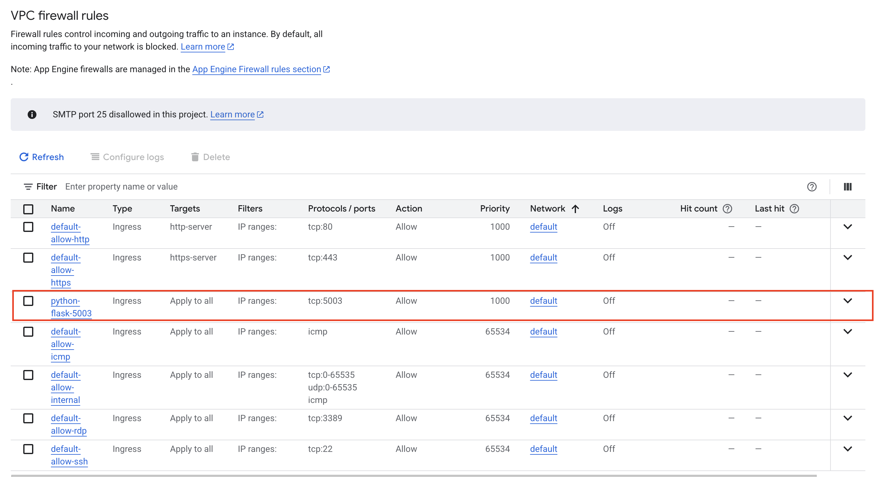
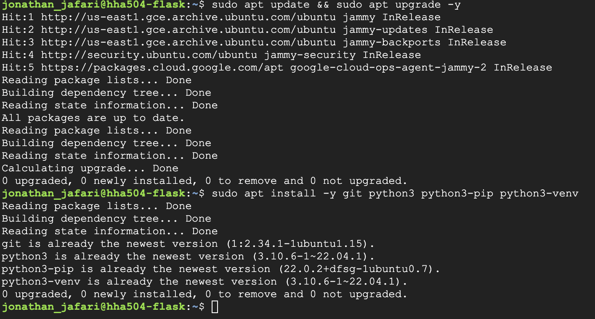
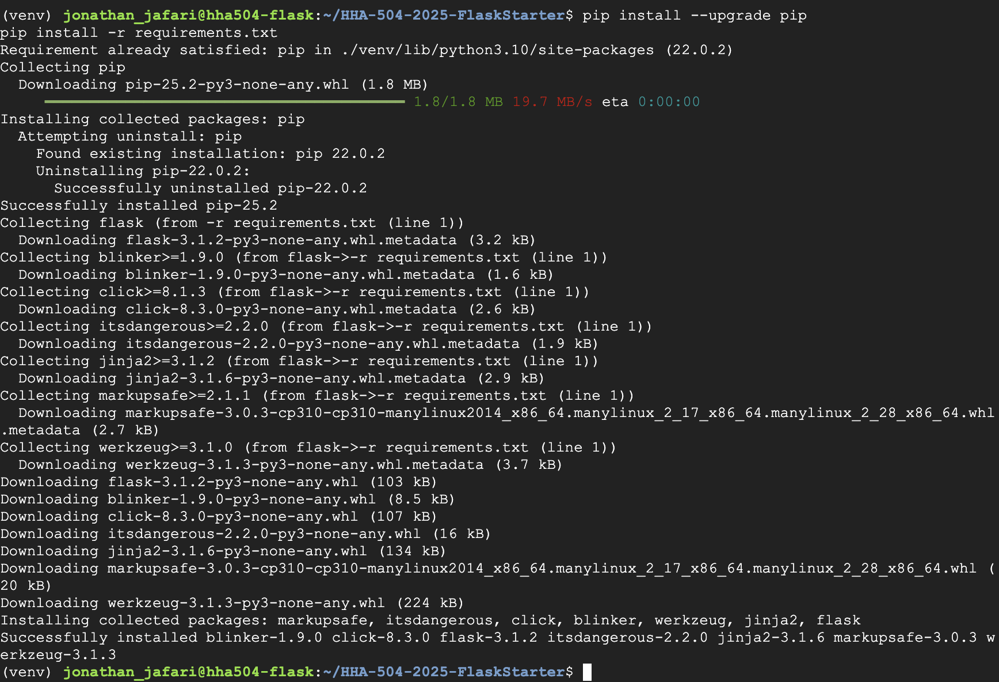
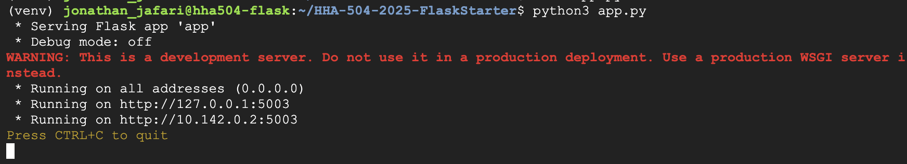
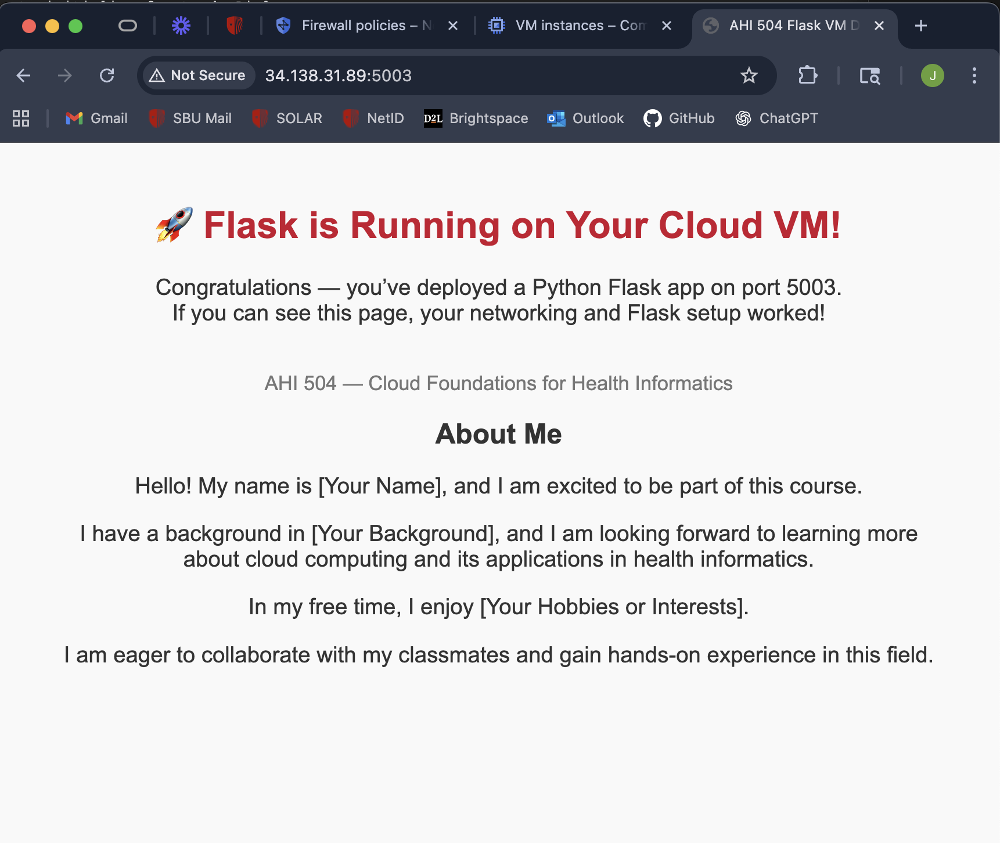
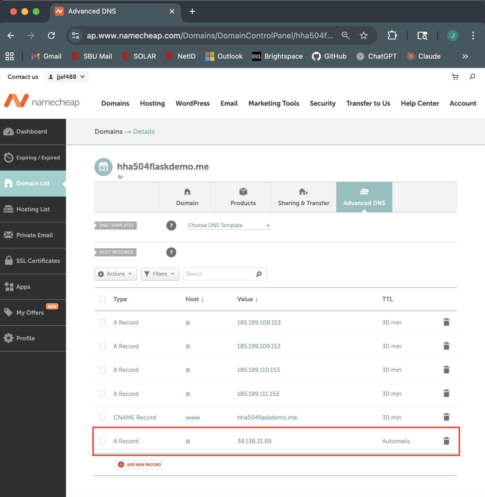
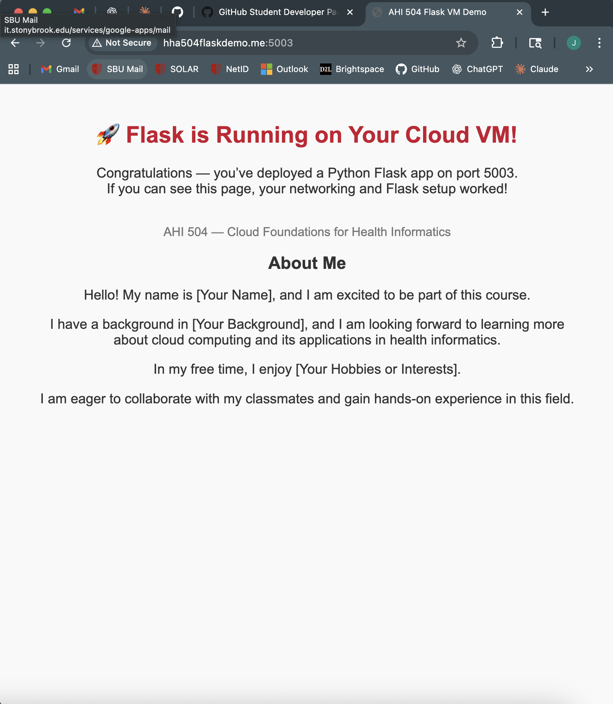

# Flask on Cloud VM (Assignment 2)

## Student Info
- **Name:** Jonathan Jafari  
- **Cloud Provider:** Google Cloud Platform (GCP)  
- **Video Recording (Zoom/Loom):** [Click here to watch](PASTE_YOUR_LINK_HERE)  

---

## Steps & Screenshots

### 1. VM Creation
Created a new VM instance in Google Cloud.  

---

### 2. Firewall Rule Configuration
Configured a firewall rule to allow traffic on port **5003**.  

---

### 3. OS Update + Python Install
Updated packages and installed Python, pip, and git.  

---

### 4. Python Environment + Flask Install
Created a virtual environment, upgraded pip, and installed Flask dependencies.  

---

### 5. Flask App Setup
Created `app.py` with a simple Flask app that returns an HTML page.  

---

### 6. Flask App Running
Successfully started Flask on port **5003** and confirmed it was accessible.  

---

### 7a. Domain Registration
Registered a free `.me` domain via Namecheap (through GitHub Student Pack).  

---

### 7b. Domain DNS Setup
Configured DNS records to point the domain to the Google Cloud VM.  

---

## Final Notes
- Flask app is accessible via the VM external IP on port **5003**.  
- Bonus: Linked a custom domain (Namecheap → GCP External IP).  

